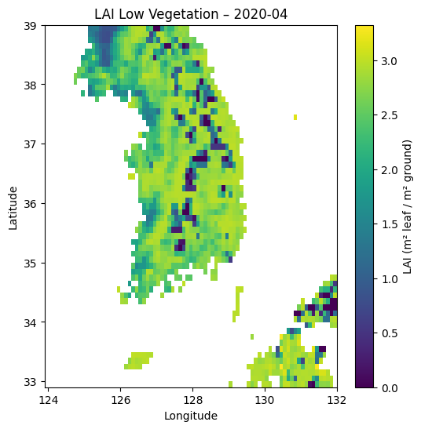
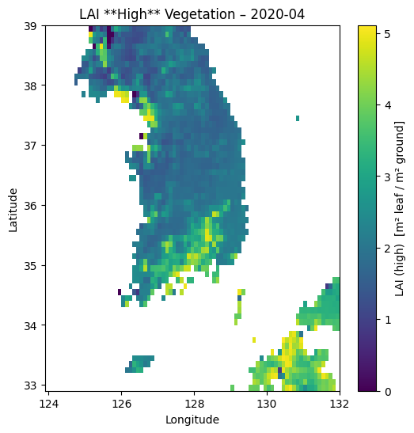

# 대한민국 월별 잎 면적 지수(LAI) 데이터

## 개요

이 저장소에는 Copernicus LAI v2 데이터를 바탕으로 대한민국(경도 124°E\~132°E, 위도 33°N\~39°N) 구역을 0.1° × 0.1° 해상도로 재처리한 저층(`lai_low`) 및 고층(`lai_high`) 잎 면적 지수(Leaf Area Index) 월별 평균값이 포함되어 있습니다.

- **LAI (Leaf Area Index)**: 단위 지면 면적당 식물 잎 면적의 비율(m²/m²)로, 식생량·연료량 및 광합성 활동의 지표로 활용됩니다.
- **저층 식생(`lai_low`)**: 초지, 관목 등 하층 식생을 대표
- **고층 식생(`lai_high`)**: 숲 상층부 수목을 대표

## 데이터 출처

- **원본 데이터셋**: Copernicus LAI v2 (월별 합성, 300 m 해상도) — ed48f79bc88a221192613d5f105743ed.nc 파일로 다운로드
- **공간 범위**: 경도 124°E\~132°E, 위도 33°N\~39°N
- **시간 범위**: 2000-01-01 \~ 2025-04-01 (월별)
- **라이선스**: Copernicus Data License Agreement (공개)

## 전처리 단계

1. **CDS API**를 통해 10일 합성 단위의 LAI_low, LAI_high 레이어 다운로드
2. **클리핑**: 대한민국 영역(경도 \[124, 132], 위도 \[33, 39])에 맞춰 잘라내기
3. **격자 변환**:

   - 원본 300 m → WGS84(EPSG:4326) 투영
   - 0.1° × 0.1° 그리드로 영역 가중 평균(resample)

4. **월별 집계**:

   - 매월 1일부터 말일까지의 10일 합성 값을 평균하여 월별 LAI_low 및 LAI_high 계산

5. **grid_id 부여**: 0.1° 그리드 셀 중심 좌표를 단일 정수로 인코딩
6. **파일 출력**:

   - Parquet(`lai_low_high_monthly.parquet`)
   - 시각화 PNG 이미지 2종 (`lai_low.png`, `lai_high.png`)

## 결측치 설명

LAI 데이터에는 다음과 같은 이유로 NaN(결측) 값이 다수 포함되어 있습니다:

| 위치/상황    | ERA5-Land의 처리                                  | 전처리 과정에서 발생하는 일                            |
| ------------ | ------------------------------------------------- | ------------------------------------------------------ |
| 완전 육지 셀 | 수치 0 이상 LAI 저장                              | 정상 값 유지                                           |
| 완전 바다 셀 | missing (NaN)으로 채움                            | `-9999`로 채운 후 DataFrame으로 읽어올 때 NaN으로 변환 |
| 해안 혼합 셀 | (8 km 원본 ↔ 0.1° 재샘플) 바다 비율 > 50%이면 NaN | 리샘플 시 주변값 평균할 데이터가 없어 NaN              |

## 파일 목록

- **lai_low_high_monthly.parquet or csv**

  - **설명**: 월별 `lai_low`, `lai_high` 값을 포함하는 테이블
  - **컬럼**:

    - `date` : 월별 기준일 (YYYY-MM-01)
    - `grid_id` : 0.1° 그리드 셀 ID (아래 \[그리드 인덱싱] 참조)
    - `lai_low` : 저층 식생 LAI (m²/m²)
    - `lai_high` : 고층 식생 LAI (m²/m²)

- **lai_low\.png**

  - **설명**: 예시월(2020-04)의 저층 식생 LAI 히트맵

- **lai_high.png**

  - **설명**: 예시월(2020-04)의 고층 식생 LAI 히트맵

## 시각화 예시

- **LAI 저층 (2020-04)**

  

- **LAI 고층 (2020-04)**

  

---

_생성일: 2025-05-22_
