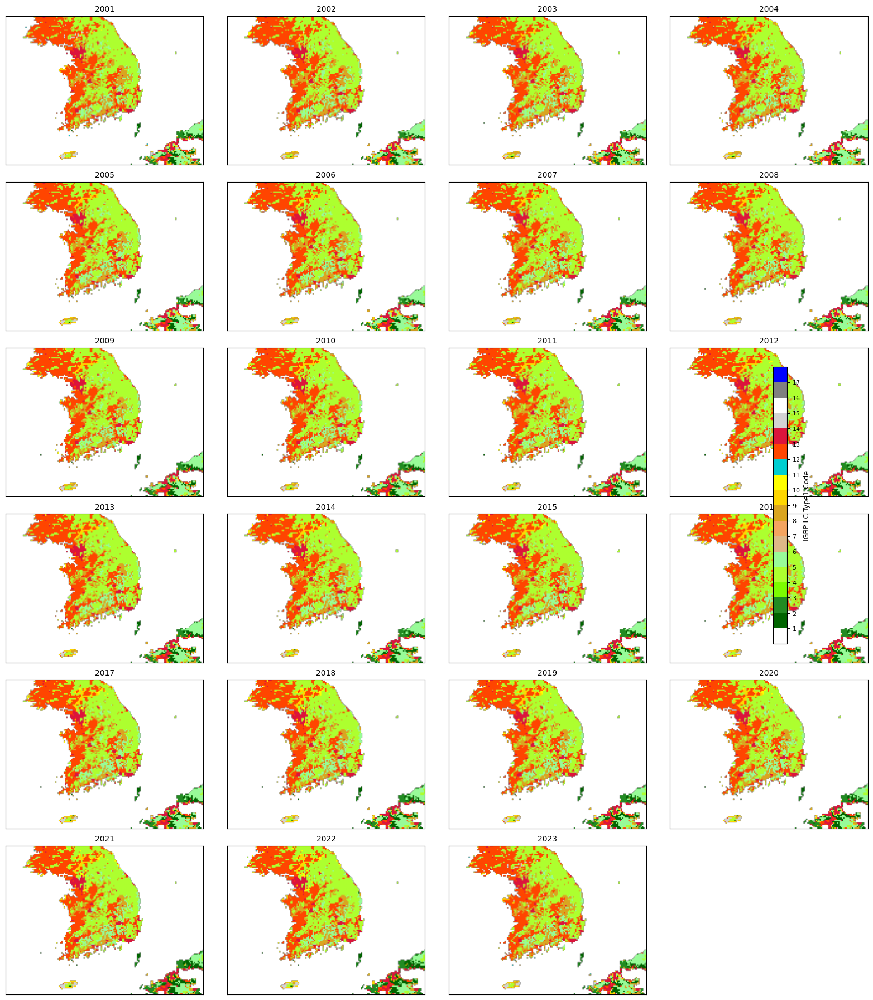

# landcover_type1_korea_2001_2023.parquet

이 파일은 **MODIS CMG 0.05° Land Cover Type 1** 데이터를 한반도(위경도 33°–39°N, 124°–132°E) 영역만 추출하여,
**연도별(2001–2023)** 단일 Parquet 파일로 통합한 결과입니다. 각 행은 날짜(`date`), 격자ID(`grid_id`), 위도(`latitude`), 경도(`longitude`),
토지피복 코드(`lc_type1`)를 가집니다.

## 파일 구조

| 열 이름     | 타입   | 설명                                      |
| ----------- | ------ | ----------------------------------------- |
| `date`      | string | 연도-월-일 형태 (예: `2023-01-01`)        |
| `grid_id`   | int    | 0.1° 격자를 고유하게 식별하는 ID          |
| `latitude`  | float  | 픽셀 중심 위도                            |
| `longitude` | float  | 픽셀 중심 경도                            |
| `lc_type1`  | int    | IGBP Land Cover Type1 코드 (아래 표 참고) |

## IGBP Land Cover Type1 코드 설명 (1–17)

| 코드 | 영문명                              | 한글 설명              | 색상(hex) |
| ---- | ----------------------------------- | ---------------------- | --------- |
| 1    | Evergreen Needleleaf Forests        | 상록 침엽수림          | `#006400` |
| 2    | Evergreen Broadleaf Forests         | 상록 활엽수림          | `#228B22` |
| 3    | Deciduous Needleleaf Forests        | 낙엽 침엽수림          | `#7CFC00` |
| 4    | Deciduous Broadleaf Forests         | 낙엽 활엽수림          | `#ADFF2F` |
| 5    | Mixed Forests                       | 혼성림                 | `#98FB98` |
| 6    | Closed Shrublands                   | 조밀 관목지            | `#DEB887` |
| 7    | Open Shrublands                     | 개방 관목지            | `#F4A460` |
| 8    | Woody Savannas                      | 나무 흩어진 사바나     | `#DAA520` |
| 9    | Savannas                            | 사바나                 | `#FFD700` |
| 10   | Grasslands                          | 초원·초지              | `#FFFF00` |
| 11   | Permanent Wetlands                  | 연중 습지              | `#00CED1` |
| 12   | Croplands                           | 농경지                 | `#FF4500` |
| 13   | Urban and Built-Up                  | 도시·인공 피복         | `#DC143C` |
| 14   | Cropland-Natural Vegetation Mosaics | 경작지+자연식생 혼합지 | `#D3D3D3` |
| 15   | Snow and Ice                        | 눈·빙하                | `#FFFFFF` |
| 16   | Barren or Sparsely Vegetated        | 불모지·희박식생        | `#808080` |
| 17   | Water Bodies                        | 수체 (호수·강·해안)    | `#0000FF` |

> **0:** 노데이터 또는 미사용(투명)으로 처리되었습니다.
> 이 표를 바탕으로 `LC_Type1` 값이 `1–5` 이면 **산/산림(forest)** 으로 분류됩니다.

## 중복 `grid_id` 처리

- `0.05°` 해상도의 원본 데이터를 **0.1°** 격자로 리샘플링하는 과정에서,
  하나의 `grid_id`에 여러 픽셀이 매핑될 수 있습니다.
- 후처리 시 **정규화** 방법을 선택해야 합니다:

  1. **Mode(최빈값)**: 하나의 대표 클래스만 선택 (간단, 정보 손실 가능)
  2. **Percent(면적 비율)**: 픽셀별 클래스 비율을 합산해 `forest_frac` 등 연속값으로 사용 (정교, 연산 비용 추가)

## 연도별 시각화

- 연도별 컬러 맵 시각화 자료입니다. IGBP 코드별 색상 팔레트가 그대로 적용됩니다.
  

---

_작성: 2025-05-23_
