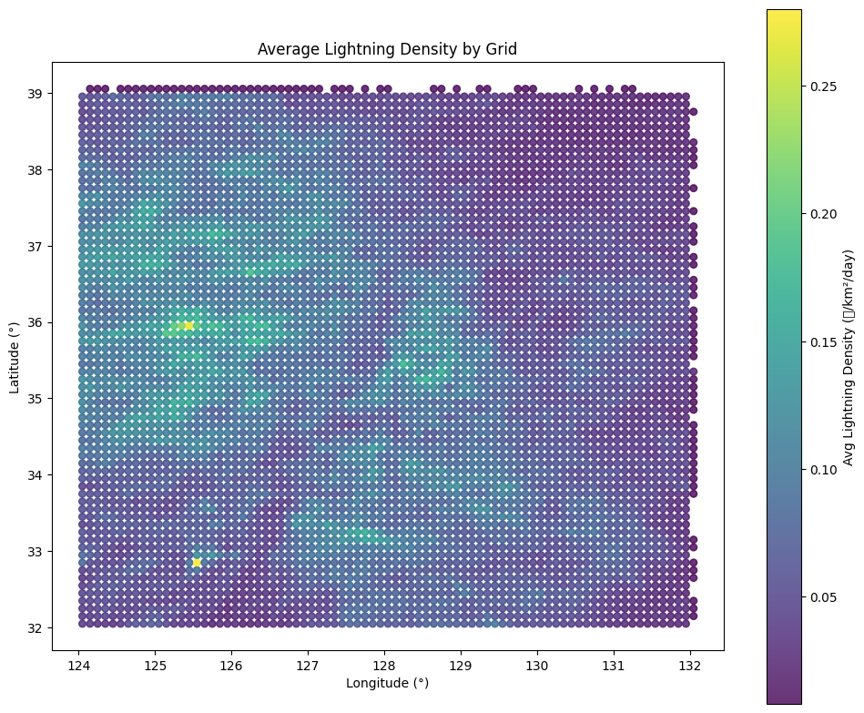

# lightning_density_KOR.csv

이 문서는 `lightning_density_KOR.csv` 파일의 구조와 내용을 설명하며, 데이터를 이해하고 활용할 수 있도록 안내합니다.

## 1. 개요

- **원본 파일**: `lightning_KOR.parquet`

- **출처**: 기상청 낙뢰관측 데이터 추출 후 통합
  https://data.kma.go.kr/data/lightning/lightningRltmList.do?pgmNo=641

- **설명**: 낙뢰 종류(대지방전=1, 구름방전=0), 낙뢰강도(kA), 발생 일시, 위도·경도를 포함한 원본 관측 데이터입니다.'강도구간'과 `polarity`는 낙뢰강도를 기준으로 추가한 열입니다.

  - `강도구간`: 전체 데이터 분포(분위수) 기반 4단계(0\~3)로 구분(6. 강도구간(Quartile) 설명 참고고)
  - `polarity`: +CG=1, -CG=0 (극성 구분은 후속 분석에 참고용으로 추가)

- **전처리 요약**:

  - `낙뢰종류`: 산불과 유의미한 대지방전만 필터링
  - `강도구간`: 전체 데이터 분포(분위수) 기반 4단계(0\~3)로 구분, Level 0은 제외(강도가 낮아 화재로 이어지기 어려움)
  - `polarity`: 구분없이 절대값으로 사용.

- **전처리파일명**: `lightning_density_KOR.csv`

- **목적**: 대한민국 내 강도구간이 0(약한 번개)을 제외한 낙뢰 이벤트를 격자(grid)·날짜별로 집계하여, 단위 면적(0.1°×0.1°)당 일별 번개 발생 빈도를 계산한 데이터셋

- **단위**: 회/km²/day

## 2. 파일 구조

| 컬럼 이름           | 데이터 타입 | 설명                                         |
| ------------------- | ----------- | -------------------------------------------- |
| `grid_id`           | integer     | 0.1° 격자의 고유 ID (lat_bin, lon_bin 기반)  |
| `date`              | yyyy-MM-dd  | 이벤트 집계 기준 일자                        |
| `count`             | integer     | 해당 그리드·일자 내 번개 발생 횟수           |
| `lightning_density` | float       | 단위 면적당 일일 번개 발생 빈도 (회/km²/day) |

## 3. 격자(grid_id) 정의 격자(grid_id) 정의

- 위도(lat), 경도(lon)를 0.1° 단위로 이산화하여 생성한 격자
- 계산식:

  1. `lat_bin = floor(lat / 0.1)`
  2. `lon_bin = floor(lon / 0.1)`
  3. `grid_id = (lat_bin + 900) * 3600 + (lon_bin + 1800)`

## 4. 밀도 계산 방법

1. **카운트 집계**: 동일한 `grid_id`와 `date`를 가진 레코드 수 집계 → `count`
2. **면적 근사**: 0.1° × 0.1° 격자는 약 `(111 km × 0.1)² ≈ 123.21 km²`
3. **밀도 계산**:

   ```
   lightning_density = count / 123.21  # 회/km²/day
   ```

## 5. 이미지 삽입 예시

리포지토리에 업로드한 `lightning_density_by_grid.png` 이미지를 README에 아래와 같이 표시할 수 있습니다. 이 이미지는 0.1° 격자별 평균 번개 밀도를 색상으로 표현한 산점도입니다:

```markdown

```

## 6. 강도구간(Quartile) 설명

`lightning_KOR.parquet` 원본 데이터를 기반으로 산출한 `낙뢰강도`의 분포는 다음과 같은 주요 분위수(Quantiles)를 가집니다:

```
0.01 (01%) = 2.3 kA
0.10 (10%) = 4.7 kA
0.25 (25%) = 7.5 kA   ← 하위 25% 경계
0.50 (50%) = 12.8 kA  ← 중앙값
0.75 (75%) = 21.6 kA  ← 상위 25% 경계
0.90 (90%) = 34.0 kA
0.99 (99%) = 79.2 kA
```

이를 바탕으로 `강도구간`은 절댓값 기준으로 다음과 같이 4분위로 나누고, 가장 약한 Level 0(하위 25% 미만)은 제외하였습니다:

| Level  | 조건   | 설명 |           |                |
| ------ | ------ | ---- | --------- | -------------- |
| 0-제외 |        | 강도 | < 7.5 kA  | 하위(-25%)     |
| 1      | 7.5 ≤  | 강도 | < 12.8 kA | 중하위(25–50%) |
| 2      | 12.8 ≤ | 강도 | < 21.6 kA | 중상위(50–75%) |
| 3      |        | 강도 | ≥ 21.6 kA | 상위(75–100%)  |

---

작성일: YYYY-MM-DD
