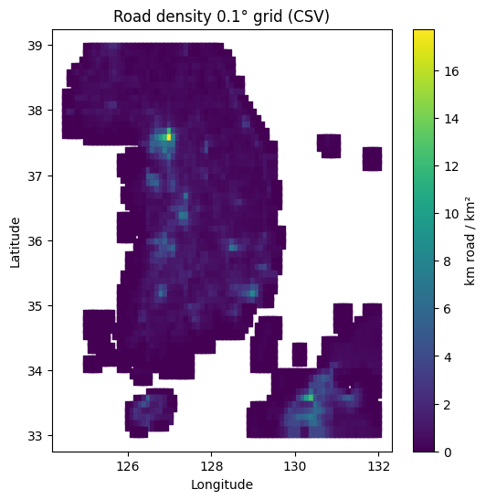

# 대한민국 도로 밀도 데이터 (0.1° 그리드)

## 개요

이 저장소에는 대한민국 한반도(경도 124°E\~132°E, 위도 33°N\~39°N) 구역을 0.1° × 0.1°(약 11 km) 해상도로 표현한 도로 밀도 데이터가 포함되어 있습니다. 도로 밀도(㎢당 도로 길이 km)는 산불 위험도 및 토지 이용 연구에서 인간 접근성과 점화 위험의 대리 변수로 활용됩니다.

## 데이터 출처

- **원본 데이터셋**: CIESIN GRiD-2018 글로벌 도로 밀도 래스터
- **원래 해상도**: 5′(약 9 km) → 0.1°(약 11 km) 그리드로 재샘플링
- **공간 범위**: 경도 124°E\~132°E, 위도 33°N\~39°N
- **라이선스**: CC BY 4.0 (CIESIN GRiD-2018)

## 전처리 단계

1. CIESIN GRiD-2018 포털에서 GeoTIFF 파일 다운로드
2. 대한민국 영역(경도 \[124, 132], 위도 \[33, 39])으로 클리핑
3. 필요 시 WGS84(EPSG:4326)로 재투영
4. GDAL `warp` 또는 CDO `remap`을 사용해 0.1° 그리드로 영역 가중 평균(resample)
5. 각 그리드 셀 내 도로 총 길이(km)를 셀 면적(km²)로 나누어 도로 밀도 계산
6. 결과를 CSV(`road_density_0.1deg.csv`)로 내보내고 참고용 시각화 히트맵 이미지(`road_density.png`) 생성(아래 시각화 자료 참고)

## 파일 목록

- **road_density_0.1deg.csv**

  - **설명**: 그리드 셀별 도로 밀도 테이블
  - **컬럼**:

    - `grid_id` : 0.1° 그리드 셀 고유 식별자 (아래 \[그리드 인덱싱] 참조)
    - `road_dens` : 도로 밀도 (㎢당 도로 길이 km)

- **road_density.png**

  - **설명**: 대한민국 도로 밀도 히트맵 시각화 이미지

## 그리드 인덱싱

`grid_id`는 0.1° 셀 중심 좌표를 단일 정수로 인코딩합니다.

```python
lat_bin = floor(lat / 0.1)
lon_bin = floor(lon / 0.1)
grid_id = (lat_bin + 900) * 3600 + (lon_bin + 1800)
```

해당 `grid_id`로부터 위도·경도를 복원하는 공식:

```python
lat = ((grid_id // 3600) - 900) * 0.1 + 0.05
lon = ((grid_id % 3600) - 1800) * 0.1 + 0.05
```

## 사용 예시

```python
import pandas as pd
import matplotlib.pyplot as plt

# 데이터 로드
df = pd.read_csv('road_density_0.1deg.csv')

# grid_id → 위도, 경도 변환
df['lat'] = ((df['grid_id'] // 3600) - 900) * 0.1 + 0.05
df['lon'] = ((df['grid_id'] % 3600) - 1800) * 0.1 + 0.05
print(df.head())

# 간단한 시각화
plt.figure(figsize=(8,6))
plt.scatter(df['lon'], df['lat'], c=df['road_dens'], s=5, cmap='viridis')
plt.colorbar(label='도로 밀도 (km/km²)')
plt.title('대한민국 도로 밀도 (0.1° 그리드)')
plt.xlabel('경도'); plt.ylabel('위도')
plt.show()
```

## 시각화

전처리된 도로 밀도 데이터를 기반으로 생성한 히트맵 예시입니다. 색 농도가 밝을수록 도로 밀도가 높은 지역을 나타냅니다.


## 데이터터 라이선스

- **원본 데이터 라이선스**: CC BY 4.0 (CIESIN GRiD-2018)

---

_생성일: 2025-05-22_
