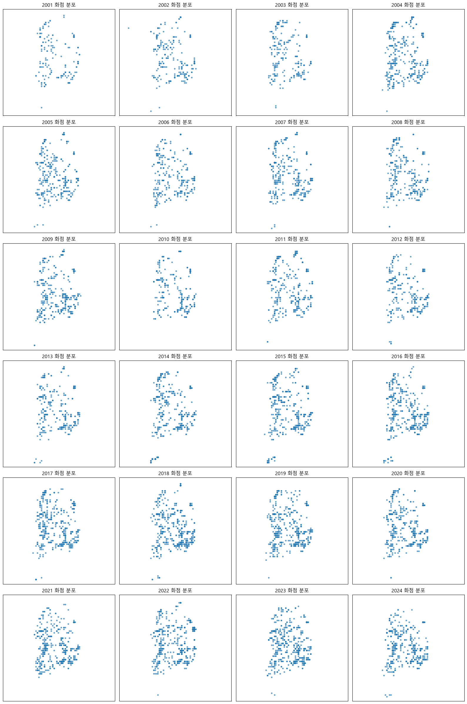

# 화재 화점 전처리 데이터 README

## 개요

이 저장소에는 NASA FIRMS(Fire Information for Resource Management System)에서 제공한 화재 화점 데이터를 전처리한 결과를 포함합니다. 원본 CSV 파일에서 다음 과정을 거쳐 날짜, 격자 식별자(grid_id), 화점 플래그(af_flag) 컬럼만 추출했습니다.

- **원본 데이터**:
   - fire_archive_M-C61_615377.csv : 2000.11월~2025.01월 화점 데이터
   - fire_nrt_M-C61_615377.csv : 2025.02월~2025.05.19일 화점 데이터 (이후 데이터는 API로 불러와야함)
     
- **전처리 데이터**:
   - af_flag_archive.csv : 2000.11월~2025.01월 화점 데이터
   - af_flag_nrt.csv : 2025.02월~2025.05.19일 화점 데이터

## 전처리 단계

1. **CSV 로드**

   - `acq_date`, `confidence`, `latitude`, `longitude` 컬럼만 선택하여 읽어들임

2. **날짜 파싱**

   - `acq_date`를 `date`로 컬럼명 변경하고, `parse_dates` 옵션으로 `datetime64[ns]` 타입으로 변환

3. **화점 플래그(af_flag) 생성**

   - `confidence`가 30초과인 경우 `1`, 30이하인 경우 `0`으로 표시
   - 클래스 불균형 해결을 위해 화점이 없었던 (date, grid_id) 조합을 생성하여 af_flag=0으로 추가
   - `uint8` 타입으로 저장하여 메모리 최적화

4. **그리드 식별자(grid_id) 부여**

   - 위도·경도 → 0.1° 그리드 중심 계산 후 단일 정수로 인코딩

   ```python
   lat_bin = floor(latitude / 0.1)
   lon_bin = floor(longitude / 0.1)
   grid_id = (lat_bin + 900) * 3600 + (lon_bin + 1800)
   ```

### 컬럼 정보

- `date` (datetime64\[ns])

  - 화점 관측일자 (YYYY-MM-DD)

- `grid_id` (int)

  - 0.1° 그리드 셀 ID (위치 복원 공식 참고)

- `af_flag` (uint8)

  - 화점 발생 여부 플래그: 1(신뢰도 > 30%), 0(≤ 30%)


## 연도별 화점 분포 시각화

아래는 전처리된 데이터를 기반으로 생성된 연도별 화점 분포 산점도 예시 이미지입니다.

- **2001년\~2024년**

  

<!-- 필요에 따라 연도별 이미지 및 설명을 추가하세요 -->

---

_생성일: 2025-05-22_
