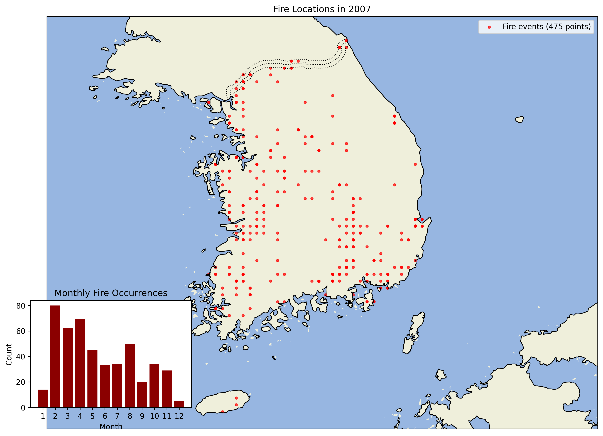
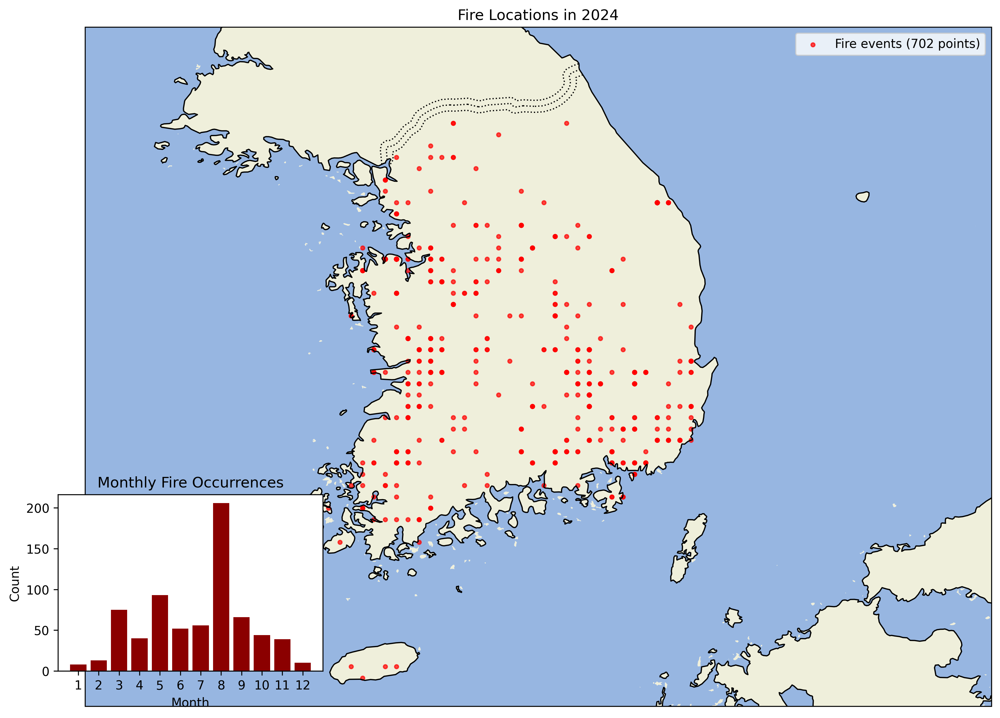

# 화재 분포 시각화

## 시각화 개요

이 디렉토리는 한국의 산불 발생 데이터 시각화 스크립트와 결과물을 포함합니다. 시각화는 `visualize_af_flag.py` 스크립트를 사용하여 생성됩니다.

## 시각화 결과 해석법

### 연도별 화재 분포 지도

- **점**: 각 점은 해당 연도에 해당 위치에서 발생한 화재를 나타냅니다
- **월별 차트(작은 삽입 차트)**: 월별 화재 발생 빈도를 보여줍니다
- **레이블**: 해당 연도의 총 화재 발생 수를 표시합니다

### 통합 연도 지도

- **다양한 색상의 점**: 각 색상은 다른 연도를 나타냅니다
- **범례**: 각 색상이 어떤 연도를 나타내는지와 해당 연도의 화재 발생 수를 보여줍니다

## 주요 인사이트 도출 방법

1. **공간 패턴**: 화재가 자주 발생하는 지역을 식별합니다
2. **계절적 패턴**: 월별 차트를 통해 화재가 많이 발생하는 시기를 파악합니다
3. **연도별 변화**: 연도별 지도와 통합 지도를 비교하여 화재 분포의 변화를 관찰합니다

## 모든 연도별 시각화 결과

시각화 결과는 현재 디렉토리에서 확인할 수 있습니다. 아래는 모든 연도의 시각화 결과입니다:

### 2000년 화재 분포


### 2001년 화재 분포


### 2002년 화재 분포


### 2003년 화재 분포


### 2004년 화재 분포


### 2005년 화재 분포


### 2006년 화재 분포


### 2007년 화재 분포



### 2008년 화재 분포


### 2009년 화재 분포


### 2010년 화재 분포


### 2011년 화재 분포


### 2012년 화재 분포


### 2013년 화재 분포


### 2014년 화재 분포


### 2015년 화재 분포


### 2016년 화재 분포


### 2017년 화재 분포


### 2018년 화재 분포


### 2019년 화재 분포


### 2020년 화재 분포


### 2021년 화재 분포


### 2022년 화재 분포


### 2023년 화재 분포


### 2024년 화재 분포



### 2025년 화재 분포 (부분 데이터)


### 2000-2025 통합 화재 분포


## 시각화 생성 방법

다음 명령어를 사용하여 직접 시각화를 생성할 수 있습니다:

```bash
python visualize_af_flag.py --input "데이터경로/af_flag_full_combine.csv" --output-dir ./
```

## 참고 사항

- 시각화는 MODIS 활성 화재 데이터를 기반으로 합니다
- 신뢰도 30 이상의 화재 감지만 포함됩니다
- 각 점은 특정 날짜에 특정 그리드 셀에서 적어도 하나의 화재가 감지되었음을 나타냅니다
